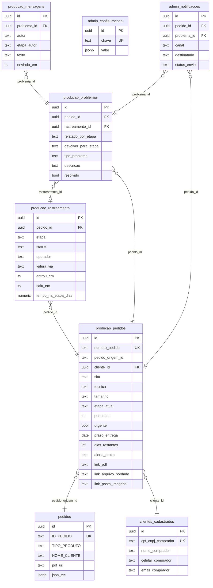

# HNT-Ops — Documento de Especificação Técnica

## Fase 1: Fundação e Arquitetura de Dados

**Versão:** 1.1.0  
**Data:** 2026-03-14  
**Projeto Base:** SimuladorHNT (Supabase: `sflllqfytzpwgnaksvkj` / sa-east-1)

---

## 📋 Sumário

1. [Visão Geral e Contexto](#1-visão-geral-e-contexto)
2. [Diagrama de Entidade-Relacionamento (ERD)](#2-diagrama-de-entidade-relacionamento-erd)
3. [Glossário de Tabelas e Colunas](#3-glossário-de-tabelas-e-colunas)
4. [Lógica de Processos e Triggers](#4-lógica-de-processos-e-triggers)
5. [Mapeamento de API — Endpoints](#5-mapeamento-de-api--endpoints)
6. [Algoritmo de Prioridade e SLA](#6-algoritmo-de-prioridade-e-sla)
7. [Arquitetura do QR Code Híbrido](#7-arquitetura-do-qr-code-híbrido)
8. [Estratégia de Storage](#8-estratégia-de-storage)
9. [Roadmap de Fases](#9-roadmap-de-fases)

---

## 1. Visão Geral e Contexto

O **HNT-Ops** é a camada de produção e controle operacional que se integra ao **SimuladorHNT** existente — sem modificar nenhuma tabela original.

### 1.1 Princípio de Integração

```text
SimuladorHNT (Vendas)          HNT-Ops (Produção)
──────────────────────         ──────────────────────────────────
pedidos              ──FK──▶   producao_pedidos
clientes_cadastrados ──FK──▶   producao_pedidos.cliente_id
                               ├── producao_rastreamento
                               ├── producao_problemas
                               │   └── producao_mensagens
                               ├── admin_configuracoes
                               └── admin_notificacoes
```

> **Regra Zero:** As tabelas originais (`pedidos`, `clientes_cadastrados`, etc.) **nunca são modificadas**. O HNT-Ops usa prefixos `producao_` e `admin_` e referencia via FK/VIEW.

### 1.2 Etapas da Linha de Produção

| # | Etapa | Responsabilidade |
| :--- | :--- | :--- |
| 1 | `Preparacao` | Viabilidade, etiquetas, fichas de produção |
| 2 | `Separacao` | Almoxarifado: tecido, elásticos, insumos |
| 3 | `Arte` | Desenvolvimento da matriz de bordado / Filme DTF |
| 4 | `Bordado` | Execução nas máquinas de bordado |
| 5 | `Costura` | Montagem física da peça |
| 6 | `Qualidade` | Arremate, conferência, passadoria |
| 7 | `Expedicao` | Embalagem, NF, envio |
| 8 | `Pendencia` | Raia de problemas e falhas (card especial) |

---

## 2. Diagrama de Entidade-Relacionamento (ERD)



---

## 3. Glossário de Tabelas e Colunas

### 3.1 `producao_pedidos` — Tabela Central

> Representa cada pedido em produção. É criada quando o pedido chega do SimuladorHNT.

| Coluna | Tipo | O que é |
| :--- | :--- | :--- |
| `numero_pedido` | TEXT | Código legível gerado automaticamente: **HNT-2026-0001** |
| `pedido_origem_id` | TEXT | ID do pedido no SimuladorHNT (`ID_PEDIDO`) |
| `cliente_id` | UUID | Referência ao cliente em `clientes_cadastrados` |
| `sku` | TEXT | Código base do modelo (ex: `SHORTS-FIGHT-01`) |
| `tecnica` | ENUM | `Bordado` / `DTF` / `Bordado e DTF` / `Sublimacao` |
| `tamanho` | TEXT | P, M, G, GG, XG… |
| `cor_centro` | TEXT | Cor da área central da peça |
| `cor_laterais` | TEXT | Cor das laterais |
| `cor_filete` | TEXT | Cor do filete/detalhe |
| `etapa_atual` | ENUM | Etapa de produção onde a peça está agora |
| `prioridade` | INT | 0=Normal → 5=Máxima (definida pelo gestor) |
| `urgente` | BOOL | Flag de atendimento especial/urgente |
| `data_entrada` | DATE | Quando o pedido entrou no sistema |
| `prazo_entrega` | DATE | Data de entrega prometida ao cliente |
| `dias_restantes` | INT | Calculado: `prazo_entrega - hoje` |
| `dias_producao_estimado` | INT | Total de dias estimados para produzir (Admin) |
| `alerta_prazo` | ENUM | `Verde` / `Amarelo` / `Laranja` / `Vermelho` |
| `link_pdf` | TEXT | URL do PDF de simulação no Storage |
| `link_arquivo_bordado` | TEXT | URL da matriz `.emb` / `.dst` no Storage |
| `link_pasta_imagens` | TEXT | URL da pasta de imagens do cliente no Storage |

---

### 3.2 `producao_rastreamento` — Log de Movimentação

> Um registro novo é criado automaticamente cada vez que a peça muda de etapa.

| Coluna | Tipo | O que é |
| :--- | :--- | :--- |
| `pedido_id` | UUID | Qual pedido passou por essa etapa |
| `etapa` | ENUM | Nome da etapa (ex: `Bordado`) |
| `status` | ENUM | `Aguardando` / `Em Andamento` / `Concluido` / `Devolvido` |
| `operador` | TEXT | Nome de quem fez o check-in nessa etapa |
| `leitura_via` | TEXT | `Webcam` / `Celular` / `Manual` |
| `entrou_em` | TIMESTAMP | Quando a peça chegou nessa etapa |
| `saiu_em` | TIMESTAMP | Quando a peça saiu dessa etapa |
| `tempo_na_etapa_dias` | NUMERIC | Calculado: `(saiu_em - entrou_em)` em dias decimais |
| `rubrica_assinada` | BOOL | Se o operador assinou o checklist físico |

---

### 3.3 `producao_problemas` — Falhas e Pendências

> Criado quando um operador reporta um problema. Suporta devolução de card entre etapas.

| Coluna | Tipo | O que é |
| :--- | :--- | :--- |
| `pedido_id` | UUID | Pedido com problema |
| `rastreamento_id` | UUID | Em qual passagem de etapa ocorreu |
| `relatado_por_etapa` | ENUM | Etapa que reportou (ex: `Costura`) |
| `devolver_para_etapa` | ENUM | Etapa responsável pelo erro (ex: `Bordado`) — para devolução |
| `tipo_problema` | ENUM | `Erro de Arte` / `Falta de Insumo` / `Máquina Quebrada`… |
| `descricao` | TEXT | Relato livre do operador |
| `foto_url` | TEXT | Evidência fotográfica no Storage |
| `resolvido` | BOOL | Se o problema foi resolvido |
| `como_foi_resolvido` | TEXT | Descrição da solução aplicada |
| `resolvido_por` | TEXT | Nome de quem resolveu |

---

### 3.4 `producao_mensagens` — Chat Entre Setores

> Chat interno vinculado a um problema específico.

| Coluna | Tipo | O que é |
| :--- | :--- | :--- |
| `problema_id` | UUID | Qual problema esse chat pertence |
| `autor` | TEXT | Nome do operador que enviou |
| `etapa_autor` | ENUM | De qual etapa escreveu |
| `texto` | TEXT | Conteúdo da mensagem |
| `tipo` | TEXT | `Texto` / `Imagem` / `Sistema` |
| `anexo_url` | TEXT | Arquivo anexado (imagem, etc.) |
| `enviado_em` | TIMESTAMP | Horário do envio |

---

### 3.5 `admin_configuracoes` — Painel do Gestor

> Todas as configurações operacionais em formato chave → JSON.

| Chave | O que configura |
| :--- | :--- |
| `tempo_medio_por_etapa` | Dias úteis por etapa (base do algoritmo) |
| `semaforo_prazo` | Em quantos dias cada cor do semáforo é ativada |
| `gatilhos_notificacao` | Quando disparar alertas automáticos |
| `destinatarios_alerta` | WhatsApp / e-mail do gestor e equipe |
| `qr_code` | URL base e comportamento padrão do QR Code |

---

### 3.6 `admin_notificacoes` — Log de Alertas Enviados

| Coluna | Tipo | O que é |
| :--- | :--- | :--- |
| `pedido_id` | UUID | Pedido relacionado (opcional) |
| `problema_id` | UUID | Problema relacionado (opcional) |
| `canal` | ENUM | `WhatsApp` / `Email` / `Sistema` |
| `destinatario` | TEXT | Número ou endereço de e-mail |
| `mensagem` | TEXT | Texto enviado |
| `status_envio` | TEXT | `Pendente` / `Enviado` / `Falhou` |
| `tentativas` | INT | Quantas tentativas de envio foram feitas |
| `erro` | TEXT | Detalhe do erro (se falhou) |

---

## 4. Lógica de Processos e Triggers

### 4.1 Ao criar um pedido

1. `trg_numero_pedido` → gera `HNT-2026-NNNN` automaticamente
2. `trg_calcular_alerta` → define a cor do semáforo baseado no prazo
3. `trg_etapa_inicial` → abre o rastreamento em `Preparacao`

### 4.2 Ao mudar de etapa (`etapa_atual`)

1. `trg_mudanca_etapa` → fecha o registro atual (`saiu_em = NOW()`, `status = Concluido`)
2. → abre novo registro para a etapa nova (`entrou_em = NOW()`, `status = Em Andamento`)

### 4.3 Ao salvar prazo (`prazo_entrega`)

1. `trg_calcular_alerta` → recalcula o semáforo automaticamente

### 4.4 Recálculo diário (Edge Function cron)

- `fn_recalcular_semaforos` → roda à meia-noite e atualiza todos os semáforos
- `fn_alertar_parados` → identifica pedidos parados além do limite configurado

---

## 5. Mapeamento de API — Endpoints

> Base URL: `https://sflllqfytzpwgnaksvkj.supabase.co`  
> Autenticação: `Authorization: Bearer {anon_key}`

### Pedidos de Produção

| Método | Path | Uso |
| :--- | :--- | :--- |
| `GET` | `/rest/v1/dashboard_pedidos` | Lista do dashboard completo (VIEW) |
| `POST` | `/rest/v1/producao_pedidos` | Criar pedido de produção |
| `GET` | `/rest/v1/producao_pedidos?id=eq.{id}` | Buscar pedido por UUID |
| `PATCH` | `/rest/v1/producao_pedidos?id=eq.{id}` | Mover etapa / alterar prioridade |
| `GET` | `/rest/v1/producao_pedidos?numero_pedido=eq.HNT-2026-0001` | Busca por número legível |

### Busca Global

```http
GET /rest/v1/dashboard_pedidos?or=(
  numero_pedido.ilike.%{query}%,
  cliente_nome.ilike.%{query}%,
  sku.ilike.%{query}%,
  cliente_cpf.ilike.%{query}%
)
```

### Rastreamento

| Método | Path | Uso |
| :--- | :--- | :--- |
| `GET` | `/rest/v1/producao_rastreamento?pedido_id=eq.{id}&order=entrou_em.asc` | Histórico completo |

### Problemas e Chat

| Método | Path | Uso |
| :--- | :--- | :--- |
| `POST` | `/rest/v1/producao_problemas` | Reportar problema |
| `PATCH` | `/rest/v1/producao_problemas?id=eq.{id}` | Resolver problema |
| `POST` | `/rest/v1/producao_mensagens` | Enviar mensagem no chat |
| `GET` | `/rest/v1/producao_mensagens?problema_id=eq.{id}&order=enviado_em.asc` | Buscar chat |

### QR Code (Scan)

```http
GET  /rest/v1/producao_pedidos?numero_pedido=eq.{qr}&select=id,etapa_atual,alerta_prazo
PATCH /rest/v1/producao_pedidos?id=eq.{id}  body: { "etapa_atual": "Bordado", "operador": "João" }
```

### Edge Functions Planejadas

| Função | Quando roda |
| :--- | :--- |
| `notificar-whatsapp` | Webhook ao criar problema / prazo estourado |
| `notificar-email` | Webhook ao criar problema / pedido concluído |
| `recalcular-semaforos` | Cron diário às 00:00 |
| `alertar-pedidos-parados` | Cron a cada 4 horas |

---

## 6. Algoritmo de Prioridade e SLA

### Fórmula de Score (quanto maior = mais urgente)

```text
Score = (prioridade × 10)
      + (urgente ? +50 : 0)
      + MAX(0, 10 - folga_dias)
      + (prazo estourado ? +100 : 0)

onde:
  folga_dias = dias_restantes - dias_producao_estimado
```

### Semáforo de Prazo (configurável pelo Admin)

| Cor | Condição padrão |
| :--- | :--- |
| 🟢 `Verde` | Mais de 3 dias até o prazo |
| 🟡 `Amarelo` | Entre 1 e 3 dias até o prazo |
| 🟠 `Laranja` | 1 dia até o prazo |
| 🔴 `Vermelho` | Prazo estourado (0 ou negativo) |

---

## 7. Arquitetura do QR Code Híbrido

### Conteúdo codificado no QR

```text
https://hnt-ops.app/scan/HNT-2026-0001
```

### Fluxo de leitura

```text
QR Escaneado
    ├── Desktop (Webcam)
    │   Biblioteca: html5-qrcode
    │   → Pop-up: "Mover HNT-2026-0001 para [Bordado]? ✅ ❌"
    │
    └── Mobile (Câmera do celular)
        PWA com getUserMedia()
        → Tela simples: botão grande "CONFIRMAR ETAPA"
            → PATCH producao_pedidos { etapa_atual: "Bordado", leitura_via: "Celular" }
                → Trigger registra rastreamento automaticamente
```

---

## 8. Estratégia de Storage

| Bucket | Acesso | Conteúdo |
| :--- | :--- | :--- |
| `simulacoes-pdf` | Público | PDFs gerados pelo SimuladorHNT |
| `arquivos-bordado` | Privado | Matrizes `.emb` / `.dst` / `.pes` |
| `imagens-pedido` | Privado | Imagens enviadas pelo cliente |
| `fichas-producao` | Privado | Fichas técnicas geradas em PDF |
| `fotos-problemas` | Privado | Fotos de falhas reportadas em produção |

**Estrutura de pastas:**

```text
imagens-pedido/{numero_pedido}/frente.jpg
arquivos-bordado/{numero_pedido}/matriz.emb
fichas-producao/{numero_pedido}/ficha.pdf
fotos-problemas/{problema_id}/foto_01.jpg
```

---

## 9. Roadmap de Fases

| Fase | Escopo | Status |
| :--- | :--- | :--- |
| **1** | Schema de Banco + API Map + ERD | ✅ Este documento |
| **2** | Dashboard em Lista (UI) | ✅ |
| **3** | Kanban de Etapas (Drag & Drop) | ✅ |
| **4** | Ficha de Produção (imprimível + QR) | ✅ |
| **5** | QR Code Híbrido (webcam + mobile) | ✅ |
| **6** | Problemas e Chat entre Setores | ✅ |
| **7** | Notificações WhatsApp + E-mail | ⬜ (Pendente Credenciais) |
| **8** | Proteção por Senha e Gestão de Operadores | ⬜ |
| **9** | QA & Sandbox (Gerador de Dados) | ✅ |
| **10** | Onboarding & Manual do Operador | ✅ |
| **11** | API de Consulta p/ IA de Vendas | ✅ |
| **12** | Relatórios e BI Avançado | ✅ |
| **13** | Painel Admin (Histórico de Logs & Auditoria) | ⬜ |

## 🛡️ Detalhamento das Etapas de Finalização

### Etapa 8: Segurança Avançada e Auditoria

- **Ícone Visível**: O acesso ao Admin é visível a todos, mas protegido por senha.

- **Gestão de Usuários**: Cadastro interno de operadores com login/senha.
- **Histórico de Logs**: Registro de quem acessou, quando e em qual equipamento (User Agent).

- **Admin**: Acesso total (Configurações, Financeiro, Exclusão).
- **Gerente**: Gestão de prioridades, resolução de pendências e visão de produtividade.
- **Operador**: Foco total no Leitor de QR e Kanban do seu setor. Sem visão de BI ou financeiro.

### Etapa 13: Painel Admin Revisitado

- **Auditoria**: Visualização completa de logs de acesso.

- **Controle de Equipe**: CRUD de operadores no banco de dados.

### 🧪 Etapa 9: Quality Assurance (QA) e Sandbox

Criação de ambiente de simulação para testar o algoritmo de priorização e estresse do banco.

- Script de geração de 100+ pedidos randômicos.
- Validação do `score_ordenacao` (Prioridade Inteligente).

### 📖 Etapa 10: Onboarding e Glossário (Manual do Bot)

Facilitar a entrada de novos colaboradores.

- **Tooltips**: Explicações de termos como SKU, SLA e Prazo.
- **Welcome Step**: Tutorial rápido em 3 passos no primeiro login.

### 🤖 Etapa 11: Integração com o Agente de Vendas

Exposição de dados para a IA do WhatsApp atender clientes em tempo real.

- **Status de Produção**: Consulta rápida por número de pedido ou CPF.
- **Read-Only Pattern**: Segurança total sem risco de escrita via IA externa.

## 🔗 Integração Futura (Simulador -> HNT-Ops)

> **⚠️ OBSERVAÇÃO DE INTEGRAÇÃO (PENDENTE):**
> Foi mapeado que os pedidos entrarão na esteira de produção **somente após a confirmação de pagamento** no e-commerce/Simulador. Como o fluxo de pagamento ainda não está 100% implantado no `SimuladorHNT`, a criação automática do pedido de fábrica a partir da venda foi adiada.
>
> **A Solução Planejada (Gatilho SQL):**
> Quando o pagamento for concluído no Simulador e o status de uma venda mudar para "Pago/Aprovado", um *Trigger* diretamente no banco de dados Supabase detectará essa mudança e fará um `INSERT` seguro na tabela `producao_pedidos`. Isso iniciará a contagem do prazo de SLA e colocará o card na etapa de **"Preparacao"**.
>
> *Um arquivo de rascunho chamado `draft_integracao_pagamento.sql` foi gerado na pasta raiz para ser usado no momento em que o módulo de pagamento for ao ar!*

## 🗂 Fluxo Dinâmico & Gestão de Etapas (Admin)

O sistema foi evoluído para permitir o controle total do fluxo de produção diretamente pelo Painel Admin, sem necessidade de alterações no código.

- **Gerenciamento de Colunas**: Inclusão, edição (label, cor, ícone) e exclusão de etapas do Kanban.
- **Ordenação Visual**: Controle da posição das colunas no quadro através de setas de ordenação no Admin.
- **Esquema de Cores Dinâmico**: Cada etapa possui sua própria identidade visual refletida em badges, bordas e na Matriz de Prazos.
- **Sincronização em Tempo Real**: Alterações na estrutura do Kanban são refletidas instantaneamente em todas as instâncias abertas da aplicação.

## 📦 Operações em Lote (Batch Processing)

Implementado módulo de alta produtividade para movimentação massiva de pedidos.

- **Check-in Contínuo**: O scanner de QR Code em lote permite ler múltiplos cards em sequência sem fechar o modal.
- **Lista de Conferência**: Todos os pedidos escaneados são listados para revisão antes da execução.
- **Movimentação Massiva**: Permite mover todos os itens escaneados para uma etapa específica (ex: enviar 20 pedidos da "Arte" para o "Bordado" de uma vez).

## ⚙️ Limites de Tolerância nas Etapas (SLA Visual)

Sistema de zonas visuais na Matriz de Prazos de Produção:

- **Verde**: Período planejado de cada etapa (dias previstos).
- **Âmbar Hachureado**: Banda de tolerância configurável (±N dias) — pedidos nesta zona estão em alerta mas dentro do aceitável.
- **Vermelho**: Fora do prazo máximo configurado — exige intervenção.
- **Textos Indicativos de Fase** no Kanban e na Lista: "CONFORTÁVEL", "NO PRAZO", "ATENÇÃO", "EM RISCO", "CRÍTICO", "VENCIDO", "URGENTE VENCIDO".

---

## 🗓 Próximas Fases (Planejadas — Não Implementadas)

> Consultar: `ROADMAP_FASE7_INTEGRACOES.md` para detalhes completos.

### Fase 7 — Webhook N8N + WhatsApp 🔔

- Trigger Postgres detecta pedido movido para "Pendência"
- Supabase Edge Function dispara webhook para N8N
- N8N formata e envia mensagem WhatsApp ao gerente (via Evolution API)
- Fallback por e-mail se WhatsApp falhar
- **Stubs preparados:** `edge-functions/notify-pendencia/index.ts`, `n8n/workflow-pendencia-STUB.json`

### Fase 4 — Fichas de Produção Robustas 📄

- Upload de arte aprovada pelo cliente no Supabase Storage
- Ficha A4 com miniatura da arte + QR Code real do pedido
- Layout profissional com tabela de assinatura por etapa
- **Stubs preparados:** `migration_fase4_e_fase7_STUB.sql`

---

HNT-Ops v1.3.0 — Gerado por Antigravity AI | Arquiteto de Sistemas
