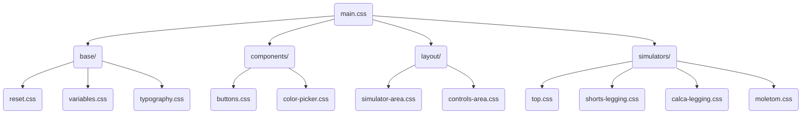

# 🥋 SimulatorHNT - Simulador Modular de Produtos


[](#)
[](#)
[](#)

Um simulador de produtos com efeito 3D de alta performance para vestuário esportivo. Apresenta design responsivo, tema escuro premium, customização em tempo real e geração automatizada de PDF.

---

## ✨ Funcionalidades Principais

- 🎨 **5 Simuladores Modulares**: Top, Shorts Legging, Calça Legging, Fight Shorts, Moletom
- 📱 **Design Responsivo**: Otimizado para Mobile (320px+), Tablet (768px+) e Desktop
- 🌙 **Tema Escuro Premium**: Interface moderna e profissional
- 🎨 **Customização em Tempo Real**: Cores, logos, textos e estampas personalizáveis
- 📄 **Geração Automática de PDF**: Exportação de designs para impressão
- 🛒 **Sistema de Carrinho**: Gestão completa de pedidos
- 👤 **Painel Admin**: Controle de configurações, produtos e preços
- 🔐 **Autenticação Segura**: Sistema de login com proteção de rotas
- ⚡ **Sistema Eco**: Orquestração inteligente com modelos de IA gratuitos

---

## 🏗️ Arquitetura

O projeto utiliza uma estrutura modular moderna e organizada:

### 📂 Organização de Pastas

```text
SimulatorHNT/
├── css/                    # Estilos modulares
│   ├── base/              # Reset, variáveis, tipografia
│   ├── components/        # Botões, color-picker, etc.
│   ├── layout/            # Áreas do simulador e controles
│   └── simulators/        # Estilos específicos por produto
├── js/modules/            # Lógica de negócio encapsulada
│   ├── common/           # Utilitários compartilhados
│   └── [produto]/        # Estado e lógica por produto
├── tools/                # Scripts de desenvolvimento
├── docs/                 # Documentação técnica
├── .agent/              # Sistema de orquestração
│   ├── scripts/         # Scripts Python de automação
│   └── workflows/       # Workflows de comandos
└── server/              # Backend Node.js/Express
```

### 🎨 Sistema CSS Modular



### ⚙️ Módulos JavaScript

Toda a lógica central está encapsulada em `js/modules/`:

- **common/**: Utilitários compartilhados, BaseSimulator e Componentes de UI
- **[produto]/**: Estado, lógica e visuais específicos de cada produto
- **cart/**: Gerenciamento do carrinho de compras
- **admin/**: Painel administrativo

---

## 🚀 Como Começar

### Pré-requisitos

- **Node.js** 14+ (para o servidor e testes)
- **Python** 3.x (para sistema de orquestração)
- **OpenCode CLI** (opcional, para modo econômico)
- Um navegador web moderno (Chrome/Edge recomendado)

### Instalação

1. Clone o repositório:

   ```bash
   git clone [URL_DO_REPOSITORIO]
   cd SimulatorHNT
   ```

2. Instale as dependências:

   ```bash
   npm install
   ```

3. Inicie o servidor local:

   ```bash
   npm start
   ```

4. Abra qualquer simulador no navegador:
   - `IndexTop.html`
   - `IndexShortsLegging.html`
   - `IndexCalcaLegging.html`
   - `IndexFightShorts.html`
   - `IndexMoletom.html`

---

## 🧪 Testes

Usamos o **Jest** para testes unitários dos componentes principais.

Executar testes:

```bash
npm test
```

Cobertura de testes:

- ✅ Lógica do componente `ColorPicker`
- ✅ Gerenciamento de estado do `BaseSimulator`
- ✅ Validação de formulários
- ⏳ Testes de regressão visual (Próximo)

---

## 🛠️ Stack Tecnológica

### Frontend

- **HTML5** - Estrutura semântica
- **CSS3** - Estilos modulares com variáveis CSS
- **JavaScript ES6+** - Módulos nativos, async/await

### Backend

- **Node.js** - Runtime JavaScript
- **Express** - Framework web
- **XLSX** - Processamento de planilhas

### Ferramentas

- **html2canvas** - Captura de tela para PDF
- **dom-to-image-more** - Conversão DOM para imagem
- **Jest** - Framework de testes
- **OpenCode CLI** - Integração com modelos de IA

### Sistema de Orquestração

- **Python 3.x** - Scripts de automação
- **OpenRouter API** - Acesso a modelos de IA gratuitos
- **Fallback Inteligente** - Resiliência entre Tier S, A, B

---

## 📱 Responsividade

O projeto é totalmente responsivo com breakpoints otimizados:

- **Mobile**: 320px - 767px
- **Tablet**: 768px - 1023px
- **Desktop**: 1024px+

Veja mais detalhes em [docs/RESPONSIVE_DESIGN.md](docs/RESPONSIVE_DESIGN.md)

---

## 📜 Documentação

### Guias Principais

- 📖 [Catálogo de Funcionalidades](docs/FEATURES.md) - Lista completa de recursos
- 🏛️ [Arquitetura Técnica](docs/ARCHITECTURE.md) - Detalhes de implementação
- 📱 [Design Responsivo](docs/RESPONSIVE_DESIGN.md) - Estratégias de layout
- 🔐 [Guia de Autenticação](docs/AUTHENTICATION_GUIDE.md) - Sistema de login

### Guias Técnicos

- ⚡ [Sistema Eco/Orchestrate](docs/GUIA_IMPLANTACAO_ECO.md) - Orquestração com IA
- 📋 [Plano de Responsividade](docs/PLAN.md) - Histórico de implementação

---

## 🤝 Contribuindo

Contribuições são bem-vindas! Por favor:

1. Faça um fork do projeto
2. Crie uma branch para sua feature (`git checkout -b feature/NovaFuncionalidade`)
3. Commit suas mudanças (`git commit -m 'Adiciona nova funcionalidade'`)
4. Push para a branch (`git push origin feature/NovaFuncionalidade`)
5. Abra um Pull Request

---

## 📄 Licença

Este projeto está sob a licença MIT. Veja o arquivo `LICENSE` para mais detalhes.

---

## 👥 Equipe

Desenvolvido com ❤️ pela **Equipe Hanuthai**.

---

## 📞 Suporte

Para questões e suporte:

- 📧 Email: [contato@hanuthai.com]
- 💬 Issues: [GitHub Issues]
