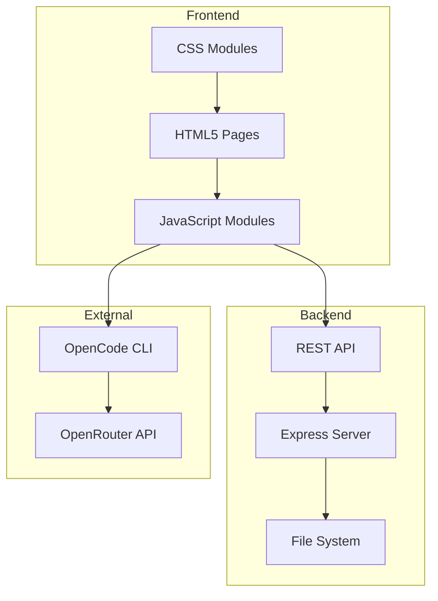
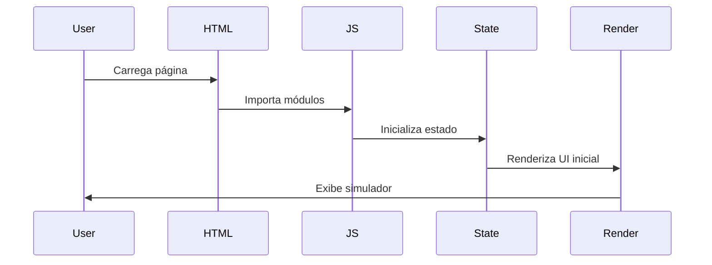
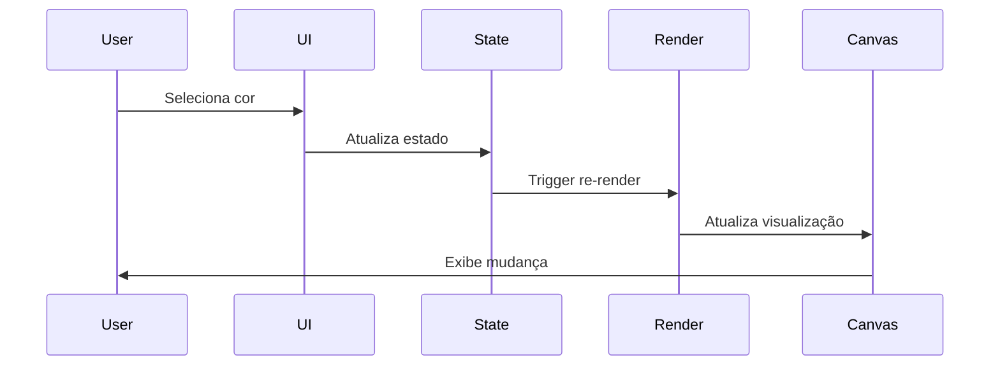
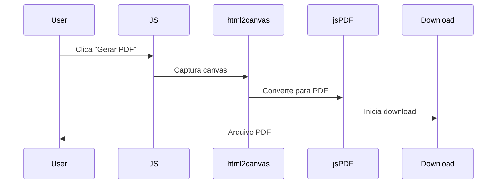
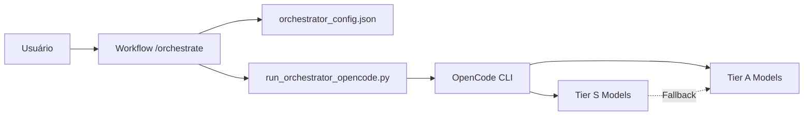
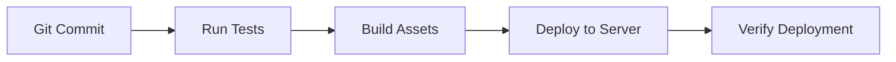

# 🏛️ Arquitetura Técnica - SimulatorHNT

Este documento descreve a arquitetura técnica do SimulatorHNT, incluindo decisões de design, padrões utilizados e fluxo de dados.

---

## 📐 Visão Geral da Arquitetura

O SimulatorHNT segue uma arquitetura modular baseada em componentes, com separação clara entre apresentação, lógica de negócio e dados.



---

## 🎯 Princípios de Design

### 1. Modularidade

- Cada simulador é um módulo independente
- Componentes reutilizáveis (ColorPicker, LogoUploader, etc.)
- Separação de responsabilidades

### 2. Escalabilidade

- Fácil adição de novos simuladores
- Sistema de plugins para extensões
- Configuração centralizada

### 3. Manutenibilidade

- Código autodocumentado
- Padrões consistentes
- Testes automatizados

### 4. Performance

- Lazy loading de recursos
- Otimização de renderização
- Caching inteligente

---

## 📦 Estrutura de Módulos

### Frontend Modules

```
js/modules/
├── common/
│   ├── BaseSimulator.js      # Classe base para todos os simuladores
│   ├── ColorPicker.js         # Componente de seleção de cores
│   ├── LogoUploader.js        # Upload e gestão de logos
│   ├── TextManager.js         # Gestão de textos personalizados
│   └── utils.js               # Funções utilitárias
│
├── top/
│   ├── state.js              # Estado do simulador de Top
│   ├── ui-render.js          # Renderização da UI
│   └── parts/                # Componentes específicos
│
├── shorts/
│   ├── state.js
│   ├── ui-render.js
│   └── parts/
│
├── calca-legging/
│   ├── state.js
│   ├── ui-render.js
│   └── parts/
│
├── fight-shorts/
│   ├── state.js
│   ├── ui-render.js
│   └── parts/
│
├── moletom/
│   ├── state.js
│   ├── ui-render.js
│   └── parts/
│
├── cart/
│   └── cart-manager.js       # Gestão do carrinho
│
└── admin/
    └── admin-panel.js        # Painel administrativo
```

### CSS Modules

```
css/
├── main.css                  # Ponto de entrada
├── base/
│   ├── reset.css            # Reset CSS
│   ├── variables.css        # Variáveis CSS globais
│   └── typography.css       # Tipografia
│
├── components/
│   ├── buttons.css          # Estilos de botões
│   ├── color-picker.css     # Color picker
│   ├── forms.css            # Formulários
│   └── modals.css           # Modais
│
├── layout/
│   ├── simulator-area.css   # Área de visualização
│   ├── controls-area.css    # Área de controles
│   └── responsive.css       # Media queries
│
└── simulators/
    ├── top.css
    ├── shorts-legging.css
    ├── calca-legging.css
    ├── fight-shorts.css
    └── moletom.css
```

---

## 🔄 Fluxo de Dados

### 1. Inicialização do Simulador



### 2. Customização de Produto



### 3. Geração de PDF



---

## 🎨 Padrões de Design Utilizados

### 1. Module Pattern

Encapsulamento de funcionalidades em módulos ES6:

```javascript
// state.js
export const state = {
    colors: {},
    logos: [],
    texts: []
};

export function updateColor(zone, color) {
    state.colors[zone] = color;
}
```

### 2. Observer Pattern

Observação de mudanças de estado:

```javascript
class BaseSimulator {
    constructor() {
        this.observers = [];
    }
    
    subscribe(observer) {
        this.observers.push(observer);
    }
    
    notify(data) {
        this.observers.forEach(obs => obs(data));
    }
}
```

### 3. Factory Pattern

Criação de componentes:

```javascript
function createSimulator(type) {
    switch(type) {
        case 'top': return new TopSimulator();
        case 'shorts': return new ShortsSimulator();
        // ...
    }
}
```

---

## 🔐 Segurança

### Autenticação

- Sistema de login com sessões
- Proteção de rotas administrativas
- Tokens de autenticação

### Validação de Dados

- Validação no cliente e servidor
- Sanitização de entrada
- Proteção contra XSS e CSRF

### Armazenamento

- Dados sensíveis não armazenados no cliente
- Uso de HTTPS em produção
- Criptografia de senhas

---

## 📊 Gestão de Estado

### Estado Local (Por Simulador)

Cada simulador mantém seu próprio estado:

```javascript
const state = {
    product: {
        type: 'top',
        size: 'M'
    },
    customization: {
        colors: {
            front: '#FF0000',
            back: '#0000FF'
        },
        logos: [],
        texts: []
    },
    ui: {
        activeTab: 'colors',
        zoom: 1.0
    }
};
```

### Estado Global

Dados compartilhados entre módulos:

```javascript
const globalState = {
    cart: [],
    user: null,
    config: {}
};
```

---

## 🚀 Performance

### Otimizações Implementadas

1. **Lazy Loading**
   - Carregamento sob demanda de imagens
   - Importação dinâmica de módulos

2. **Debouncing**
   - Limitação de chamadas em eventos frequentes
   - Otimização de re-renderizações

3. **Caching**
   - Cache de imagens processadas
   - Armazenamento de configurações

4. **Minificação**
   - Compressão de CSS e JS
   - Otimização de assets

---

## 🔧 Sistema de Orquestração

### Arquitetura do Sistema Eco



### Componentes

1. **Workflows** (`.agent/workflows/`)
   - `orchestrate.md`: Workflow principal
   - `enable-eco.md`: Ativação do modo econômico
   - `disable-eco.md`: Desativação
   - `set-model.md`: Configuração de modelo

2. **Scripts** (`.agent/scripts/`)
   - `manage_orchestrator_config.py`: Gestão de configuração
   - `run_orchestrator_opencode.py`: Execução de modelos

3. **Configuração Global**
   - `~/.antigravity/orchestrator_config.json`

---

## 📡 API Backend

### Endpoints Principais

```
GET  /api/products          # Lista produtos
POST /api/cart/add          # Adiciona ao carrinho
GET  /api/cart              # Obtém carrinho
POST /api/pdf/generate      # Gera PDF
POST /api/auth/login        # Login
POST /api/auth/logout       # Logout
GET  /api/config            # Configurações
```

### Estrutura de Resposta

```json
{
    "success": true,
    "data": {},
    "message": "Operação realizada com sucesso"
}
```

---

## 🧪 Testes

### Estrutura de Testes

```
tests/
├── unit/
│   ├── ColorPicker.test.js
│   ├── BaseSimulator.test.js
│   └── utils.test.js
│
├── integration/
│   ├── cart.test.js
│   └── pdf-generation.test.js
│
└── e2e/
    └── simulator-flow.test.js
```

### Cobertura de Testes

- Componentes críticos: 90%+
- Utilitários: 95%+
- Integração: 80%+

---

## 🔄 CI/CD (Futuro)

### Pipeline Proposto



---

## 📈 Métricas e Monitoramento

### Métricas de Performance

- Tempo de carregamento inicial
- Tempo de resposta da API
- Taxa de erro
- Uso de memória

### Ferramentas

- Lighthouse (Performance)
- Chrome DevTools (Profiling)
- Jest (Cobertura de testes)

---

*Última atualização: Fevereiro 2026*
